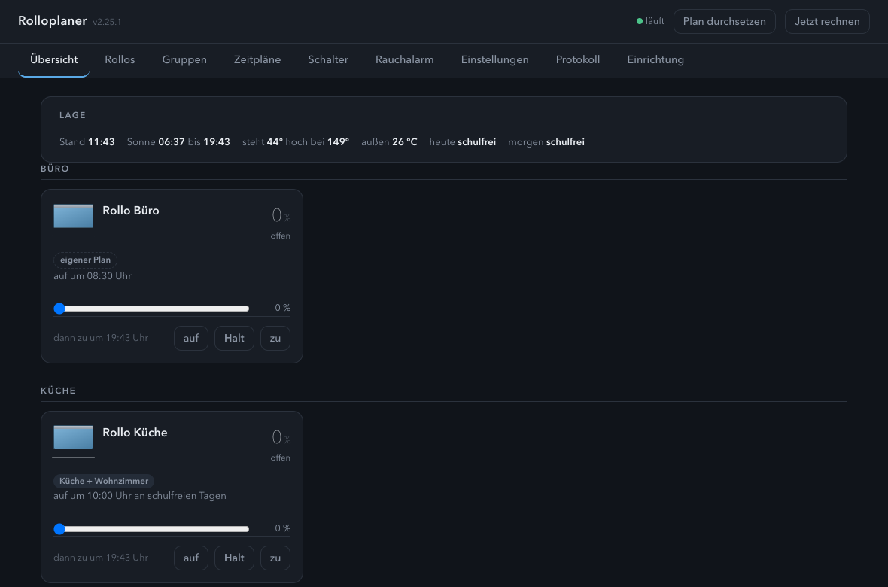
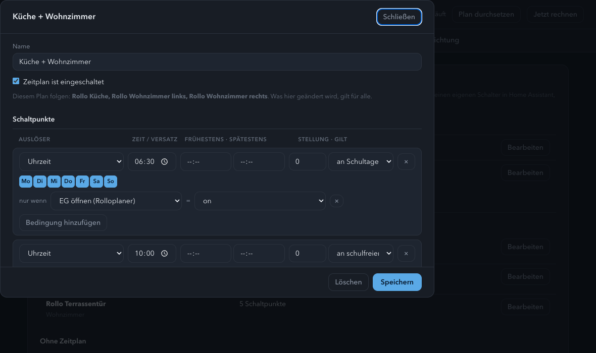
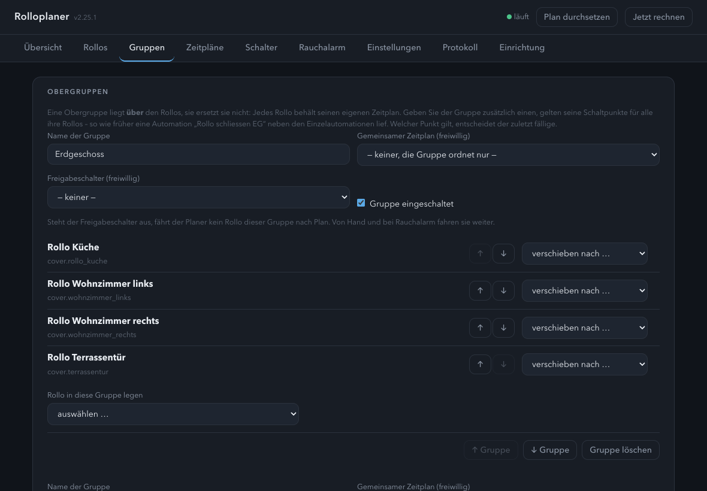
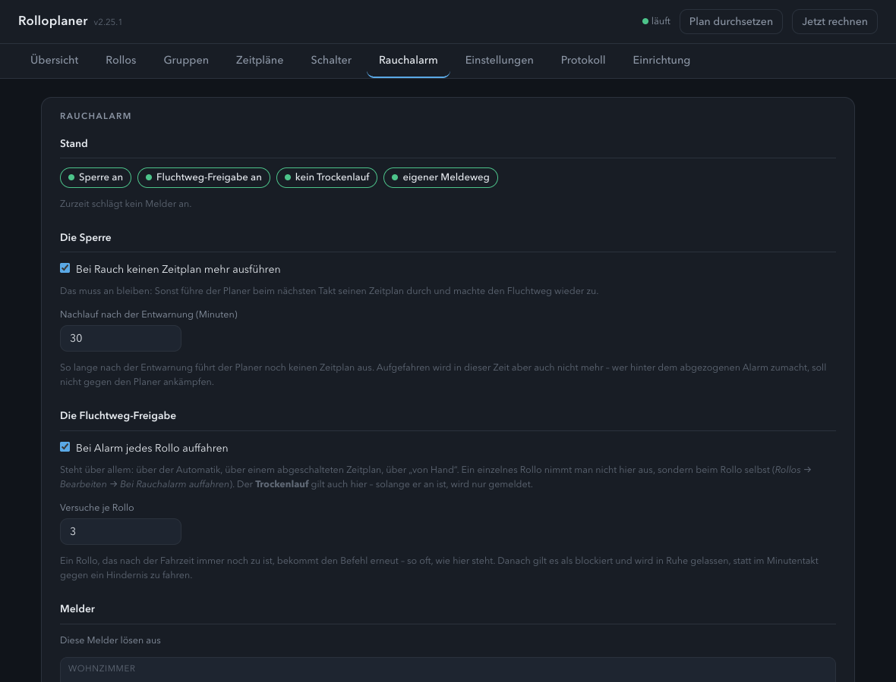
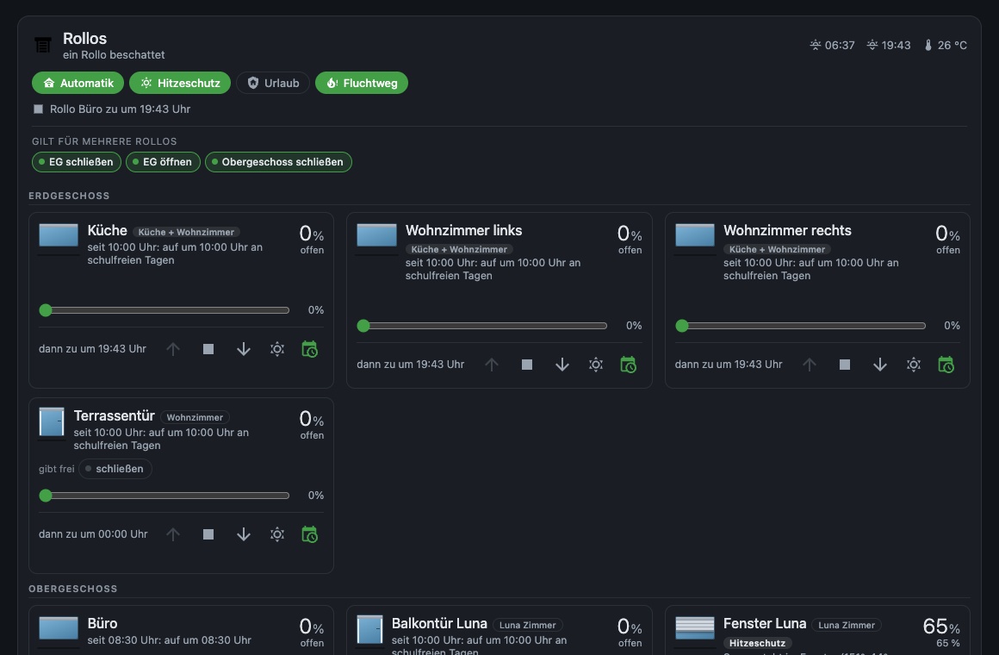
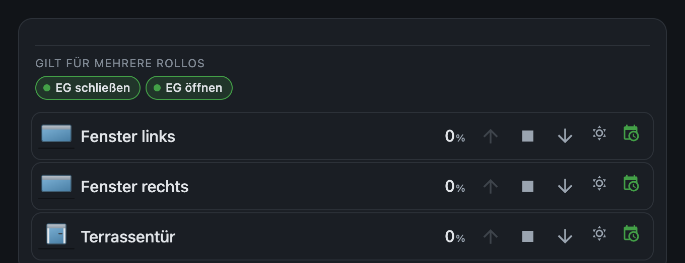

# Rolloplaner · Roller Shutter Planner

Ein Home-Assistant-Add-on für Rollläden: ein Zeitplan je Rollo, nach Uhrzeit
oder nach dem Stand der Sonne — mit eigener Lovelace-Karte.

[](https://my.home-assistant.io/redirect/supervisor_add_addon_repository/?repository_url=https%3A%2F%2Fgithub.com%2FMelle79%2FHA-rolloplaner)

> 📖 Ausführliche Anleitung: **[DOCS.md](rolloplaner/DOCS.md)** ·
> 🇬🇧 In English: **[README.md](README.md)**

Statt dreier Automationen je Rollo steht hier ein Schaltpunkt: „bei
Sonnenuntergang zufahren, spätestens 20:30, an Schultagen“. Der Planer rechnet
jeden Takt neu, fährt nur, wenn ein Punkt **neu fällig** ist — und schreibt
dazu, warum.



## Installation

Diese Adresse als Add-on-Repository in Home Assistant eintragen
(*Einstellungen → Add-ons → Add-on Store → ⋮ → Repositories*):

```
https://github.com/Melle79/HA-rolloplaner
```

Danach erscheint **Rolloplaner** im Store. Die Lovelace-Karte bringt das Add-on
selbst mit; eine getrennte Installation über HACS ist nicht nötig.

## Was der Planer kann

**Ein Zeitplan je Rollo**, der nach Uhrzeit **oder** nach dem Stand der Sonne
schaltet. Schulfrei, Feiertage und „morgen schulfrei“ kann er berücksichtigen,
und ein Schaltpunkt darf an einer Bedingung hängen — an einem Schalter, den
der Planer selbst anlegt.



Die Steuereinheit ist **das Rollo**, nicht der Raum — in jedem Haus, in dem ein
Zimmer ein Fenster *und* eine Balkontür hat, geht es nicht anders. Darüber
liegen **Obergruppen** (etwa Etagen) für alles, was zusammengehört: Sie können
einen gemeinsamen Zeitplan tragen, der zu den einzelnen dazukommt, und einen
Freigabeschalter für den ganzen Schnitt.



Dazu:

* **Hitzeschutz** nach Sonnenrichtung — fährt teilweise zu, wenn die Sonne in
  *dieses* Fenster steht und es draußen warm ist. Je Rollo schaltbar.
* **Fenstersperre** — solange ein Kontakt offen ist, wird nicht zugefahren.
  An einer Balkontür ist das der Unterschied zwischen „zu“ und „ausgesperrt“.
* **Urlaub**: geschlossen halten oder Anwesenheit simulieren, mit Streuung.
* **Wächter**, der meldet, wenn ein Antrieb sich nicht mehr rührt oder hängt.
* **Trockenlauf**: rechnet und protokolliert, fährt aber nichts — zum
  Mitlaufen neben den bestehenden Automationen.

Vorhandene Rollladen-Automationen liest das Add-on ein und schlägt vor, was es
daraus machen würde. **Übernommen wird nichts von selbst.**

## Fluchtweg bei Rauchalarm

Schlägt ein Rauchmelder an, fährt der Planer **jedes** Rollo auf — über
Automatik, Zeitplan und Handbetrieb hinweg — und meldet aufs Telefon, welche
Rollos offen sind und welche **nicht erreichbar** waren. Die Meldung nennt den
Raum des Melders, nicht nur seinen Namen. Danach führt er keinen Schaltpunkt
mehr aus, der den Weg wieder zumachen würde.



Der Rauchalarm hat einen **eigenen Reiter**. Er ist zu wichtig, um in den
Einstellungen zu stehen.

## Die Karte

`custom:rolloplaner-card` — je Rollo eine Kachel mit einem **simulierten
Rollladen** statt eines Balkens: Ein Balken sagt „65 %“, aber nicht, ob das
Rollo dabei oben oder unten ist. Vor einer Tür sieht er anders aus als vor
einem Fenster.



Bedient wird direkt in der Kachel: **auf · Halt · zu** (der Halt in der Mitte,
so wie auf jedem Handsender), ein **Schieber** für alles dazwischen, Automatik,
Hitzeschutz — und die Freigabeschalter, an denen die Schaltpunkte hängen. Halt
und Schieber erscheinen nur, wo der Antrieb sie beherrscht: Ein Knopf, der
nichts tut, ist schlimmer als keiner. Steht ein Rollo am Anschlag, ist die
Taste dorthin ausgegraut.

**Oder schlank**, eine Zeile je Rollo: Bild, Name, Stellung und dieselben
Tasten, ohne Begründung und Fahrplan. Zusammen mit dem Schnitt nach Zimmer
wird daraus eine kleine Karte je Zimmer — dort will man schalten und nicht
lesen, warum der Planer vor zwei Stunden etwas getan hat.



Eingestellt wird alles im **Karteneditor**, ohne YAML: Schriftgröße (gedacht
für ein Wandtablett), was die Karte zeigt, welche Zimmer und Gruppen in
welcher Reihenfolge erscheinen — und die Beschriftung jedes Rollos, denn wo
das Zimmer schon in der Überschrift steht, reicht „Fenster links“.

## Zweisprachig

Planer, Einrichtung, Karte und Karteneditor sprechen **Deutsch und Englisch**.
Add-on und Einrichtung folgen Home Assistant oder der Einstellung unter
*Einstellungen → Sprache*; die Karte folgt dem **Betrachter** — auf dem
Wandtablett steht Deutsch, ein englischsprachiger Gast sieht dieselbe Karte auf
Englisch. Eine dritte Sprache ist eine weitere Tabelle, kein `gettext` und kein
Bauschritt.

## Ausführlich

[rolloplaner/DOCS.md](rolloplaner/DOCS.md) — das Handbuch. Es erklärt nicht nur,
was die Knöpfe tun, sondern warum die Entscheidungen so gefallen sind: warum
auf der Flanke geschaltet wird und nicht auf dem Pegel, warum der Planer die
Sonnenzeiten selbst rechnet, und was „aus“ jeweils bedeutet.

[rolloplaner/CHANGELOG.md](rolloplaner/CHANGELOG.md) — was sich geändert hat.

## Lizenz

MIT
