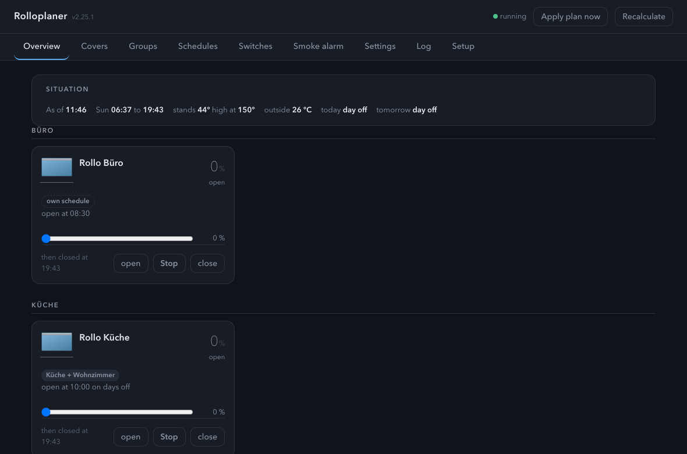
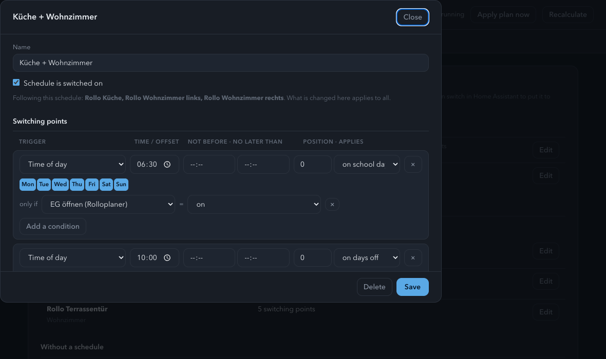
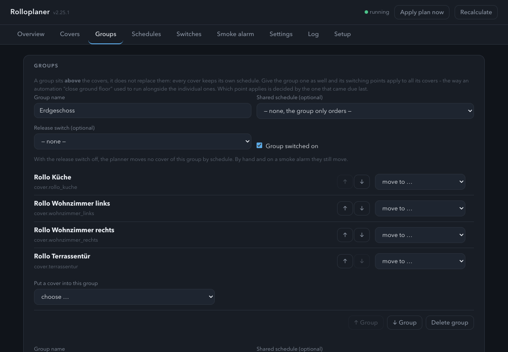
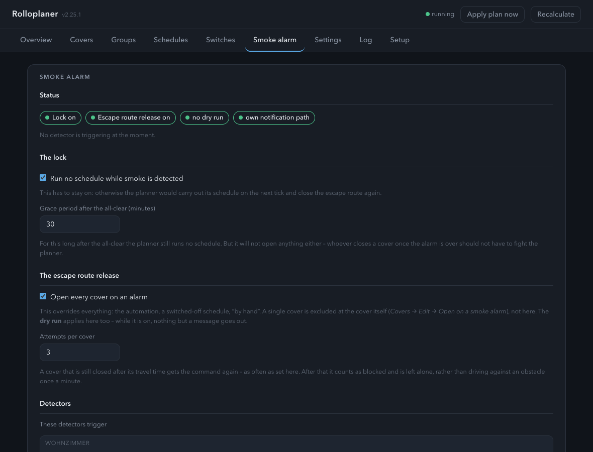
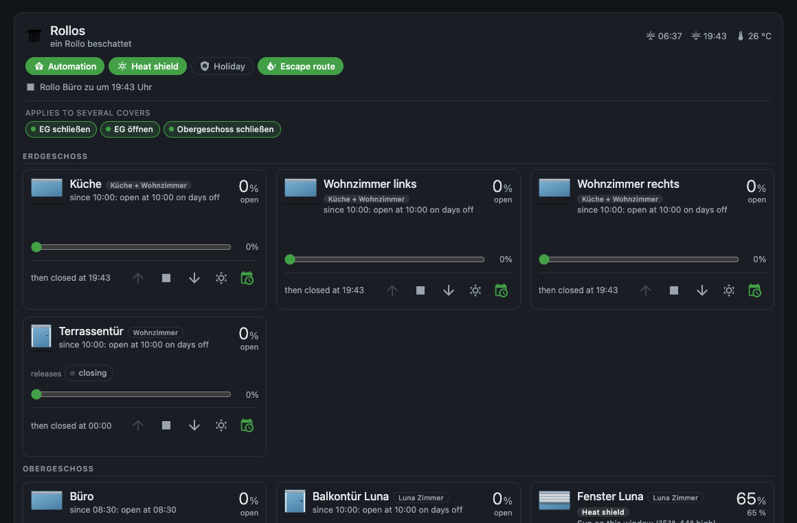
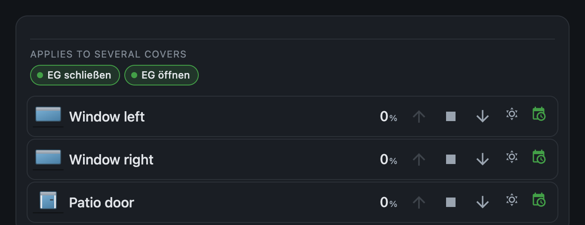

# Roller Shutter Planner · Rolloplaner

A Home Assistant add-on for roller shutters: one schedule per cover, by clock
time or by the position of the sun — with its own Lovelace card.

[](https://my.home-assistant.io/redirect/supervisor_add_addon_repository/?repository_url=https%3A%2F%2Fgithub.com%2FMelle79%2FHA-rolloplaner)

> 📖 Full manual: **[DOCS.md](rolloplaner/DOCS.md)** (German) ·
> 🇩🇪 Auf Deutsch: **[README.de.md](README.de.md)**

Instead of three automations per cover there is one switching point: “close at
sunset, no later than 20:30, on school days”. The planner recalculates on
every cycle, moves only when a point is **newly due** — and writes down why.



## Installation

Add this address as an add-on repository in Home Assistant
(*Settings → Add-ons → Add-on Store → ⋮ → Repositories*):

```
https://github.com/Melle79/HA-rolloplaner
```

**Roller Shutter Planner** then appears in the store. The add-on brings its own
Lovelace card; there is no separate HACS installation.

## What the planner does

**One schedule per cover**, switching by clock time **or** by the position of
the sun. It can take days off, public holidays and “tomorrow is a day off”
into account, and a switching point may depend on a condition — on a switch
the planner creates itself.



The unit of control is **the cover**, not the room — in any house where a room
has a window *and* a balcony door there is no other way. Above it sit
**groups** (floors, for instance) for everything that belongs together: they
can carry a shared schedule that adds to the individual ones, and a release
switch for the whole set.



On top of that:

* **Heat shield** by sun direction — closes part way when the sun stands in
  *this* window and it is warm outside. Switchable per cover.
* **Window lock** — nothing closes while a contact is open. On a balcony door
  that is the difference between “closed” and “locked out”.
* **Holiday**: keep everything closed, or simulate presence with jitter.
* **Watchdog** that reports a motor that stopped responding or is stuck.
* **Dry run**: calculates and logs but moves nothing — to run alongside the
  automations you already have.

The add-on reads existing shutter automations and proposes what it would make
of them. **Nothing is taken over on its own.**

## Escape route on a smoke alarm

When a smoke detector triggers, the planner opens **every** cover — overriding
automation, schedule and manual operation — and sends a message to the phone
saying which covers are open and which were **not reachable**. The message
names the detector's room, not just its name. After that it runs no switching
point that would close the way out again.



The smoke alarm has a **tab of its own**. It is too important to sit inside the
settings.

## The card

`custom:rolloplaner-card` — one tile per cover, with a **simulated shutter**
instead of a bar: a bar says “65 %”, but not whether the shutter is up or
down. In front of a door it looks different than in front of a window.



Operated straight from the tile: **open · stop · close** (the stop in the
middle, the way it sits on every handset), a **slider** for everything in
between, automation, heat shield — and the release switches the switching
points hang on. Stop and slider only appear where the motor supports them: a
button that does nothing is worse than no button. At the end of travel, the
button leading there is greyed out.

**Or slim**, one line per cover: picture, name, position and the same buttons,
without the reason and the schedule. Together with the cut by room this makes
a small card per room — there you want to switch, not to read why the planner
did something two hours ago.



Everything is set in the **card editor**, without YAML: text size (meant for a
wall tablet), what the card shows, which rooms and groups appear in which
order — and the label of each cover, because where the room is already in the
heading, “window left” is enough.

## Bilingual

Planner, setup, card and card editor speak **German and English**. The add-on
and its setup follow Home Assistant or the setting under *Settings →
Language*; the card follows the **viewer** — the wall tablet shows German while
an English-speaking guest sees the same card in English. A third language is
one more table, no `gettext` and no build step.

## In detail

[rolloplaner/DOCS.md](rolloplaner/DOCS.md) — the manual. It explains not only
what the buttons do but why the decisions fell the way they did: why it
switches on the edge and not on the level, why the planner computes the sun
times itself, and what “off” means in each case. *Currently German only.*

[rolloplaner/CHANGELOG.md](rolloplaner/CHANGELOG.md) — what has changed.

## Licence

MIT
